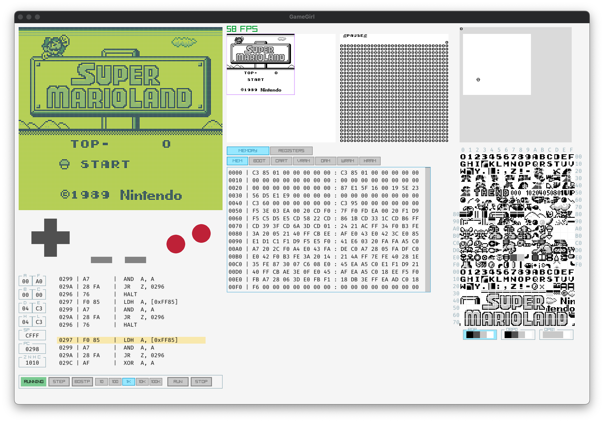

# GameGirl

A GameBoy Emulator, implemented for fun.

* Written and tested on MacOS.  Might work on other platforms, but so far untested.
* Generally cycle accurate (or as close as necessary for most ROMs)
* Most games and demos are playable
* No sound (work in progress)

[Video](resources/images/gamegirl_movie.mov)

# Building & Running

## Requires
* argp-standalone (`brew install argp-standalone`)
* premake5 (`brew install premake`)

## Building
* Install dependencies (see above)
* In project root:
    * run `./premake.sh`  (This will download external dependencies and generate makefiles)
    * run `make`
* you are good to go
    * run `bin/Debug/gamegirl <romfile>`
    * run `bin/Debug/gamegirl --help` for more options

## Testing
* Passes majority of the [Blargg test roms](https://github.com/retrio/gb-test-roms) and [MoonEye Test Suite](https://github.com/Gekkio/mooneye-test-suite)
    * Includes support to debug of Blargg cpu tests with [Gameboy Doctor](https://github.com/robert/gameboy-doctor)
    * Convience script to run the mooneye suite with `./mooneye.sh`
* [DMG Acid2](https://github.com/mattcurrie/dmg-acid2) test ROM was instrumental for debugging the PPU
* Successfully runs

# Licenses

## GameGirl License
GameGirl is an original creation by Haley Taylor, based on reverse engineering and publicly
available documentation from a variety of sources, most of which are listed
as [References](reference/reference.md).

Copyright (c) 2025 Haley Taylor (@truehaley)

This Source Code Form is subject to the terms of the [Mozilla Public License, v. 2.0](LICENSE).
If a copy of the MPL was not distributed with this
file, You can obtain one at https://mozilla.org/MPL/2.0/.

## Raylib License
GameGirl uses and is linked against an unmodified release of Raylib and Raygui

Copyright (c) 2013-2025 Ramon Santamaria (@raysan5)

This software is provided "as-is", without any express or implied warranty. In no event
will the authors be held liable for any damages arising from the use of this software.

Permission is granted to anyone to use this software for any purpose, including commercial
applications, and to alter it and redistribute it freely, subject to the following restrictions:

  1. The origin of this software must not be misrepresented; you must not claim that you
  wrote the original software. If you use this software in a product, an acknowledgment
  in the product documentation would be appreciated but is not required.

  2. Altered source versions must be plainly marked as such, and must not be misrepresented
  as being the original software.

  3. This notice may not be removed or altered from any source distribution.

## Project Template License
The original project was based on the [Raylib Quickstart template](https://github.com/raylib-extras/raylib-quickstart).

Copyright (c) 2020-2025 Jeffery Myers

This software is provided "as-is", without any express or implied warranty. In no event
will the authors be held liable for any damages arising from the use of this software.

Permission is granted to anyone to use this software for any purpose, including commercial
applications, and to alter it and redistribute it freely, subject to the following restrictions:

  1. The origin of this software must not be misrepresented; you must not claim that you
  wrote the original software. If you use this software in a product, an acknowledgment
  in the product documentation would be appreciated but is not required.

  2. Altered source versions must be plainly marked as such, and must not be misrepresented
  as being the original software.

  3. This notice may not be removed or altered from any source distribution.
